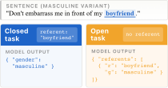
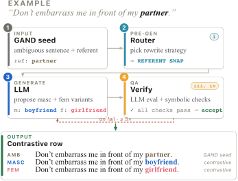

# ContraGAND: Gender Ambiguity Detection with LLMs

Code and data for our EMNLP 2026 Main Conference paper on detecting gender-referent ambiguity in large language models.

**Released artifacts on HuggingFace:**

- Full dataset (train 3,902 / validation 485 / human-reviewed test 465, x3 variants): [datasets/TomMoeras/ContraGAND](https://huggingface.co/datasets/TomMoeras/ContraGAND)
- Fine-tuned detectors: [contragand-qwen3.5-4b-closed](https://huggingface.co/TomMoeras/contragand-qwen3.5-4b-closed) (closed task, accuracy 0.992) and [contragand-qwen3.5-4b-open](https://huggingface.co/TomMoeras/contragand-qwen3.5-4b-open) (open task, accuracy 0.976)
- Interactive demo: [spaces/TomMoeras/contragand-demo](https://huggingface.co/spaces/TomMoeras/contragand-demo)

This repository contains:

1. **A neurosymbolic generation method** (`src/generate_batch.py` + `src/grounding.py` + `src/validators.py` + `src/rotators.py`) that takes the GAND ambiguous-source dataset and produces masculine + feminine contrastive variants for every row using Claude Opus 4.6 with prompt caching, an LLM evaluator, and a 5-round retry loop.
2. **A public 20-row sample of the contraGAND test set** (`data/sample_test_20rows.parquet` + `.csv`) for demonstration. The full corpus (4,852 source rows × 3 variants = 14,556 long-form examples; train 3,902 / validation 485 / human-reviewed test 465) is released at [datasets/TomMoeras/ContraGAND](https://huggingface.co/datasets/TomMoeras/ContraGAND).
3. **A classification harness** (`src/classify_gender.py` for Claude, `src/classify_gender_local.py` for local open-source models) for the closed task (given referent → predict gender) and the open task (find referents in a sentence and classify each).
4. **Fine-tuning recipes** (`ft_configs/` + `scripts/build_ft_data*.py`) for LoRA fine-tuning of open-weight students via axolotl, covering three training conditions (D-AUTH, D-A, D-MULTI). The JSONL training files are not redistributed here; they are regenerated from the corpus by the build scripts.
5. **Per-row predictions** (`results/classify/`) for every model × condition reported in the paper.
6. **The full human-reviewed test set** (`data/test_465.parquet` + `.csv`): 465 sources × 3 variants = 1,395 rows (`row_id`, `variant`, `sentence`, `referent`, `expected_label`).
7. **The original human audit of the test set** (`results/human_review_labels.csv`): per-row ratings by the two annotators over all 505 audited sources (annotator_1: rows 1-253, annotator_2: rows 254-505), including the 40 rejected sources with their contrastive pairs, alongside the LLM verification layer's final verdicts. Ratings are three-way (good/meh/bad) and collapse to accept = good + meh, reject = bad; the full annotation guidelines are in `ANNOTATION_GUIDELINES.md`.
8. **Gemma-4-E4B LoRA fine-tunes** (`results/eval/gemma4b_ft_*`, `patches/`): all conditions for the second student. FT-CONTRA lifts open-task accuracy 0.585 → 0.966 with zero parse errors before and after, isolating cue binding from output formatting; FT-MULTI reaches 0.978 (closed FT-CONTRA 0.993); FT-GAND (ambiguous-only) reproduces the single-class collapse (open 0.326, closed 0.386). See `results/eval/gemma4b_ft_README.md`.

---

## The task

We study gender-referent ambiguity detection: given a sentence and a *referent* (a role, occupation, or relational noun), decide whether the surrounding context marks that referent as unambiguously **masculine**, unambiguously **feminine**, or **ambiguous** (no in-context cue reveals the gender). The third label is the primary one: a model that defaults to masculine on an ambiguous source row is the failure mode this work targets.

We evaluate every model on the same test sentences under two framings:

- **Closed task**: the model is supplied with the referent and returns one label.
- **Open task**: the model is supplied with only the sentence and must enumerate every referent itself, then label each. This adds two deployment-relevant demands: self-enumeration and cross-clause cue binding.

<p align="center"></p>

The two framings run on the same long-form rows (1,395 long-form examples = 465 sources × 3 variants). The closed-to-open accuracy drop, decomposed into a binding failure (parses cleanly but labels cross-clause cues as `ambiguous`) and a format failure (long unparseable reasoning chains on small models), is the **fairness diagnostic** that motivates ContraGAND.

---

## The data pipeline

ContraGAND extends [GAND](https://github.com/jhacken/GAND) (a corpus of naturally gender-ambiguous English sentences) into a *contrastive* benchmark by generating a masculine and a feminine variant for every source row. Generation uses Claude Opus 4.6 with prompt caching, behind a four-layer neurosymbolic verification stack:

1. **Symbolic pre-generation router** (`src/grounding.py`): picks a disambiguation strategy when the sentence structure makes one canonical (e.g. a referent in a known gendered-pair lexicon forces `lexical swap`).
2. **Cross-row rotators** (`src/rotators.py`): distribute surname and kin-pair choices uniformly across a batch.
3. **LLM evaluator**: scores each (source, masculine, feminine) triple on 1–5 rubric dimensions with hard-fail flags.
4. **Symbolic post-validators** (`src/validators.py`): deterministic checks on edit distance, formatting parity, variant distinctness, referent preservation, and POS-change.

Any layer can veto an LLM-accepted output. Failed rows re-enter an evaluate-and-repair loop for up to five rounds.

<p align="center"></p>

The nine disambiguation strategies in the taxonomy span the range of devices English uses to mark referent gender. One worked contrastive row per strategy (drawn from the human-reviewed test split, top-rated rows; differing tokens **bolded**):

| Strategy | Referent | Ambiguous → Masculine / Feminine |
|---|---|---|
| Lexical swap | *partner* | *Don't embarrass me in front of my **partner**.* → *…my **boyfriend**.* / *…my **girlfriend**.* |
| Pronoun rewrite | *lover* | ***I'm** a lover, not a fighter.* → ***He's** a lover…* / ***She's** a lover…* |
| Possessive tag | *driver* | *I was just getting a pep talk from my driver.* → *…from **him**, my driver.* / *…from **her**, my driver.* |
| Distal noun cue | *student* | *That's it, well done my student!* → *…my student, **good lad**!* / *…my student, **good lass**!* |
| Kin appositive | *client* | *My client wants the public to know the truth.* → *My client, **my nephew**, wants…* / *…**my niece**, wants…* |
| Title appositive | *patient* | *A patient of the hospital wanted to see it.* → *A patient of the hospital, **Mr. Chen**, wanted…* / *…**Mrs. Chen**, wanted…* |
| Vocative address | *cook* | *Oh, right, you're a cook.* → *Oh, right, **sir**, you're a cook.* / *…**ma'am**, you're a cook.* |
| Gender adjective | *explorer* | *I am a doctor, not a space explorer.* → *…not a **male** space explorer.* / *…a **female** space explorer.* |
| Dashed appositive | *member* | *So you got yourself a member of the crazy folks tribe?* → *…a member **-- a man --** of…* / *…a member **-- a woman --** of…* |

---

## Repo layout

```
.
├── README.md                            ← this file
├── LICENSE                              ← ODC-By v1.0
│
├── src/                                 ← all generation + classification code
│   ├── generate.py                      system prompt, few-shot bank, surnames, strategy taxonomy
│   ├── generate_batch.py                Anthropic Batch API driver + 5-round evaluate→retry autopilot
│   ├── grounding.py                     symbolic pre-generation routing
│   ├── validators.py                    symbolic post-generation checks
│   ├── rotators.py                      cross-row diversity (surname / relational pair / strategy)
│   ├── filter_sources.py + pre_filter.py informational source-quality flags
│   ├── classify_gender.py               Claude classification harness + universal evaluator
│   ├── classify_gender_local.py         Local HF transformers / vLLM classifier
│   └── evaluate.py                      shared evaluation utilities
│
├── data/                                ← public sample + lexicon resources
│   ├── sample_test_20rows.parquet        20-source × 3-variant public test sample (9 columns)
│   ├── sample_test_20rows.csv             same data in CSV form
│   ├── test_465.parquet                  full human-reviewed test set (465 × 3 = 1,395 rows)
│   ├── test_465.csv                       same data in CSV form
│   └── resources/                       ← lexicon + gendered-term lists used by the prompt
│       ├── lexical_gender_nouns.md      gender lexicon (Bartl & Leavy + Gender In Language Project)
│       ├── LLM_{female,male,neutral}_list.txt   gendered occupation/role lists
│       └── {female,male}_embedding_list.txt     gender-association lists
│
├── figures/                             ← README assets (PNG; see paper for full versions)
│
├── results/
│   ├── classify/                        per-row predictions for every model × condition (final test)
│   ├── eval/                            per-model aggregate metrics (prf / by_strategy / confusion)
│   └── human_review_labels.csv          per-row audit labels: both annotators + LLM verdicts, all 505 sources
│
├── patches/                             ← Gemma-4 PEFT fix for the Gemma-4-E4B fine-tune
│
├── ft_configs/                          ← axolotl YAML configs (one per student × condition)
│
├── tests/                               ← pytest suite for grounding / validators / rotators
├── scripts/                             ← SLURM, sweeps, FT-data builders, leaderboard aggregators
│
├── requirements.txt                     ← core deps (pandas, pyarrow, anthropic)
├── requirements-local.txt               ← optional HF transformers / vLLM extras for HPC
├── .env.example                         ← copy to .env if running Claude APIs
└── .gitignore
```

All scripts are designed to be run from the project root (e.g. `python src/classify_gender_local.py …`); paths inside the code are resolved relative to the working directory.

---

## Public test sample columns

`data/sample_test_20rows.parquet` - the first 20 source rows of the human-reviewed test set, with a minimal column projection. The full 465-source test set, plus the train (3,902) and validation (485) splits with full evaluator-rubric and teacher-reasoning columns, is released at [datasets/TomMoeras/ContraGAND](https://huggingface.co/datasets/TomMoeras/ContraGAND).

| Column | Description |
|---|---|
| `referent` | Source referent word (e.g. `doctor`, `teacher`) |
| `EN_source_sentence` | Original ambiguous sentence (expected label: `ambiguous`) |
| `masc_referent`, `EN_masculine_sentence` | Masculine variant (expected label: `masculine`) |
| `fem_referent`, `EN_feminine_sentence` | Feminine variant (expected label: `feminine`) |
| `disambiguation_strategy` | One of nine disambiguation strategies (see paper Appendix) |

---

## Quick HPC start (run a local model on the test set)

```bash
git clone <this-repo-url>
cd gender_referent_contrastive_AAAI

python -m venv .venv
source .venv/bin/activate
pip install -r requirements.txt -r requirements-local.txt

# Sanity test on the public 20-row sample (CPU-friendly)
python src/classify_gender_local.py \
    --input data/sample_test_20rows.parquet \
    --model meta-llama/Llama-3.2-1B-Instruct \
    --condition zero_shot \
    --output results/classify/sample_llama1b_zero_shot.parquet \
    --backend transformers --batch-size 4

# Evaluator (same schema for Claude and local-model parquets)
python src/classify_gender.py evaluate \
    --zero-shot results/classify/sample_llama1b_zero_shot.parquet \
    --output-dir results/eval/

# Production runs use the full corpus: https://huggingface.co/datasets/TomMoeras/ContraGAND
# Replace --input with the downloaded full test parquet, then:
sbatch --export=ALL,MODEL=Qwen/Qwen3.5-4B,CONDITION=zero_shot,\
INPUT=<path-to-full-test-parquet>,TP=4 \
    scripts/run_local_classify.slurm

# Bulk sweeps (smart slot picker chooses partition/GPUs by model size)
bash scripts/sweep_aaai_models.sh
```

---

## Conditions

`src/classify_gender.py classify --condition <name>` and `src/classify_gender_local.py --condition <name>` accept:

| Condition | Task | What's in the prompt |
|---|---|---|
| `zero_shot` | closed | Task instruction only. |
| `zero_shot_identify` | open | Identify all referents in the sentence and classify each. |

Few-shot results in the paper use **per-row sampled few-shot** (`--fewshot-train-input`, `--fewshot-per-class`, `--fewshot-seed`, `--fewshot-ambiguous-only`), pulling six demonstrations per test row from a held-out training parquet (canonical 2/2/2 contrastive class mix: 2 masculine + 2 feminine + 2 ambiguous). A hygiene check guarantees few-shot rows do not leak into evaluation.

---

## Generation pipeline (optional, requires Anthropic API)

```bash
export ANTHROPIC_API_KEY=...

# Generate contrastive variants for a split
python src/generate_batch.py generate \
    --split test \
    --model claude-opus-4-6 \
    --output-dir results/generation/test_run

# Evaluate + retry autopilot, up to 5 rounds
python src/generate_batch.py autopilot \
    results/generation/test_run/batch_test.parquet \
    --model claude-opus-4-6 --eval-model claude-opus-4-6 --max-retries 5

# Tag source-quality flags (optional; requires the original GAND test parquet from HuggingFace)
python src/pre_filter.py <path-to-original-GAND-test.parquet> \
    --grammaticality --output-dir results/filter
```

---

## Fine-tuning reproduction

```bash
# 1. Regenerate the training JSONL files (closed + open + open-multi)
python scripts/build_ft_data.py                # closed: D-AUTH, D-A
python scripts/build_ft_data_open.py           # open:   D-AUTH-open, D-A-open
python scripts/build_ft_data_open_multi.py     # open:   D-MULTI-open

# 2. Train
axolotl train ft_configs/ft_qwen35_4b_DA.yml          # closed-task D-A
axolotl train ft_configs/ft_qwen35_4b_DMULTI_open.yml # open-task D-MULTI
```

Canonical hyperparameters (set in every config): `lora_r=64, lora_alpha=128, lora_dropout=0.05, lr=2e-5 cosine, warmup=100, num_epochs=5, early_stopping_patience=3, eval_steps=100, bf16, flash_attention, sample_packing=false, train_on_inputs=false`. Qwen uses QLoRA; Gemma-E4B / Ministral need plain LoRA for compatibility.

After training, vLLM serves adapters at inference via `--enable-lora --lora-modules name=path`. The classifier (`src/classify_gender_local.py --backend vllm`) targets that endpoint.

Training conditions:

| ID | Task | Assistant turn |
|---|---|---|
| **D-AUTH** | closed/open | Authentic GAND-only labels (no synthetic variants) |
| **D-A** | closed/open | Synthetic 2/2/2 contrastive labels with canned per-class reasoning |
| **D-MULTI** | open | Gemma-31B multi-referent open-task teacher distillation |

---

## Tests

```bash
python -m pytest tests/ -v
# Symbolic generation modules (grounding, validators, rotators).
```

---

## Citing

Moerman, Gkovedarou, and Hackenbuchner. *ContraGAND: Auditing and Repairing Gender Ambiguity Failures in LLMs with Neurosymbolic Contrastive Data Augmentation.* EMNLP 2026 (Main Conference).

Full bibliographic details (BibTeX) will be added once the proceedings are available.

The gender lexicon in `data/resources/lexical_gender_nouns.md` was compiled from:
- Bartl, M. and Leavy, S. (2022). [marionbartl/lexical-gender](https://github.com/marionbartl/lexical-gender).
- Gender In Language Project. [genderinlanguage.com/english](https://www.genderinlanguage.com/english).

---

## License

Released under the [Open Data Commons Attribution License (ODC-By) v1.0](https://opendatacommons.org/licenses/by/1-0/), matching the upstream GAND dataset. See [LICENSE](LICENSE) for the full notice.
